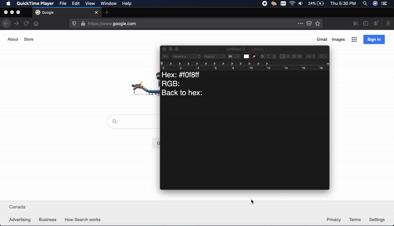

# 🎨 Colorful
A lightweight MacOS app for manipulating color codes on your clipboard.

## Features
- Lightweight
- Conveniently configured from the menu bar
- Automatically converts copied color codes to the desired encoding type

# Demo

## Installation
Download the [latest](https://github.com/zackradisic/Colorful/releases/download/0.0.1/Colorful.zip) from the 
[releases](https://github.com/zackradisic/Colorful/releases/) page, unzip it, and drag-and-drop it into your `Applications` folder.

## Planned
- Support more color code types (HSL, CMYK, etc.)
- Keyboard shortcuts to paste for specific color code types (e.g. cmd + ctrl + v to paste RGB)
- Color history

Any feature requests or questions are welcome in the Issues section.